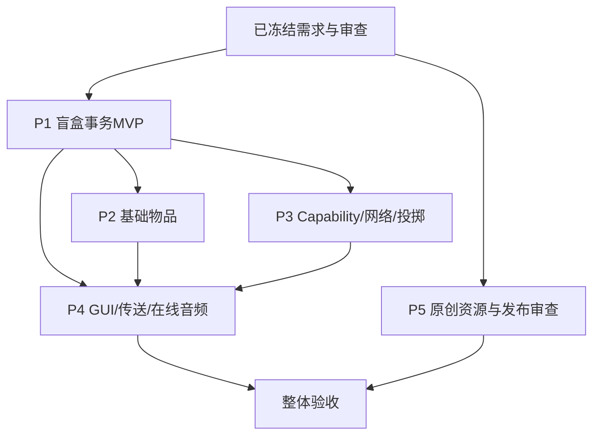

# 盲盒挑战生存：审查结论与开发计划

> 阶段：仅审查与规划（2026-08-05）。本文件已合并本轮用户定稿；除明确标为“可配置”的技术参数外，不再把已回答项列为待确认。

## 项目边界

目标为 Forge 1.20.1、Java 17 的多人可用模组。盲盒本体、全局共享奖池、打包道具、信件、在线音频、双向任意门与安全落点均已定稿；默认奖池为空。TAC、魔女服装和乐魂外部内容已明确不处理，不作为依赖或阻塞项。

## 技术设计

### 服务端权威与同步

* 客户端只发送操作意图和显示界面；伤害、药效、耐久、随机、投掷命中、传送、爆炸、死亡、实体生成和放置均在逻辑服务端执行。
* 使用 Forge `SimpleChannel`：C2S 包只用于二段跳、耳机控制及文字 GUI 提交等原版右键无法自动到服务端的输入；全部校验玩家、手持物、距离、维度、冷却、权限和目标。服务端用随机数决定结果，再用必要的 S2C 包同步。
* 普通 `Item#use`、食物、属性、药效、实体和方块状态优先使用原版同步，不创建逐 tick 广播。

### 核心盲盒：共享奖池、打包与开盒（已定稿）

主世界 `BlindBoxPoolSavedData` 保存全局共享奖池，默认空。每个奖池条目为不可变 `PrizeBundle`：条目 UUID、创建者 UUID、创建刻、版本号，以及多个完整序列化的 `ItemStack`（物品 ID、数量、NBT）。盲盒本体不保存奖品副本，只是开启凭证；开盒时由服务端从全局条目中随机取出一个完整包裹，默认等权。空奖池时提示失败，盲盒不消耗。

打包道具使用服务端菜单，提交仅代表客户端意图。服务端在同一主线程任务中重新校验玩家、会话、槽位、数量、物品 ID/NBT 指纹与光标栈；深拷贝选中物品、预演扣除和盲盒交付均能完整成功后，才写入带事务 UUID 的持久化日志、精确扣除、追加奖池条目、交付盲盒、标脏并同步容器。任一步失败均不改库存和奖池。世界载入与玩家登录时按事务 UUID、槽位指纹和盲盒收据做幂等恢复（完成一次或回滚一次）并记录审计日志；这是为弥合 Minecraft 玩家存档和世界 `SavedData` 非数据库原子提交的崩溃窗口，不能仅靠“先扣再加”的顺序。

开盒长按期间，服务器为同一盲盒实例记录会话 UUID、开始刻和持有者 UUID，并只在使用期施加减速属性修饰；松手、换手、死亡、掉线即取消/移除。客户端只渲染盒子动画和进度。完成时服务端再验证手持实例、奖池版本和完整背包容量；原子保留条目、消耗盲盒、移交奖品并提交删条目。背包容纳不足时一律不改箱/奖池；异常兜底生成仅归属该玩家的持久掉落物，绝不静默吞物。使用状态借助 ItemStack/容器同步，附近动画只发最小 S2C 事件；随机和奖池更改绝不信任客户端。

### 信件：阅读与编辑（已定稿）

右键由服务端验证当前信件实例后发送只读数据，客户端以信纸背景 Screen 展示。Shift+右键由服务端打开编辑菜单；提交包携带会话 ID、手持槽位、信件实例 UUID、修订号和正文，服务端重新比对后才写 NBT 并同步。正文只允许纯文本：默认最多 **512 个 Unicode 码点、16 行**（服务器配置可调），统一换行、拒绝控制字符和 `§` 格式码，拒绝 JSON 富文本、点击/悬停事件和命令。服务器以码点/行数检查并拒绝超限，防止超长包、格式注入及换手后的改写。

### 在线 OGG/MP3：下载、缓存与全服一次播放（已定稿）

在线 URL 音频由八音盒使用；027 耳机保留原始“播放原版音乐”需求，不能在未确认前擅自改成 URL 播放。服务端保存经校验的八音盒 URL 与播放元数据；触发时向**当前服务器内全部玩家**广播事件 UUID、URL、服务端起始刻、声源位置及“一次播放”标记。客户端自行下载、解码、缓存并播放；服务器不代理、不下载、不打包在线音乐。播放至文件结束自然停止、不循环；新登录或迟到客户端不补播已经开始的事件。

* 仅接受 `https` URL；禁用文件、`http`、数据 URI 和含认证信息的 URL。最多 3 次跳转，每跳在服务器和客户端分别重做协议、主机、DNS/IP 检查；拒绝 localhost、私有/保留/链路本地/组播地址，防 DNS 重绑定。
* 不发送 Cookie、令牌或玩家身份；连接/读取超时、最大响应大小和总下载时间为服务器配置的安全限制（建议默认 10 秒、16 MiB）。先校验内容类型与 OGG/MP3 文件头，失败/超限/解码失败只提示对应客户端，不阻塞服务端。
* 客户端缓存按 URL 与内容摘要分区，临时下载完成后原子改名；复检大小/摘要，提供 LRU 容量上限与清理。OGG 走 Minecraft/LWJGL 可用解码路径；MP3 在实现阶段锁定许可证兼容的纯客户端解码库，不调用系统播放器或要求服务器安装编解码器。下载、缓存、解码均在客户端异步线程，音频缓冲再提交音频线程。

### 状态与存档

|状态|存放位置|适用|
|---|---|---|
|玩家永久状态|Player Capability（NBT）|易筋经已学习、二段跳许可、个人冷却|
|单件物品状态|ItemStack NBT / 原版耐久|变形形态；泡澡桶耐久|
|世界共享状态|主世界 `BlindBoxPoolSavedData`|已定：全局奖池、打包/开盒事务日志、条目版本和审计收据|
|可放置物状态|BlockEntity NBT|八音盒 URL/播放态、任意门关联 UUID 与安全落点位置|
|飞行/座位实体状态|SynchedEntityData + 必要 NBT|抱枕投掷物/座位、回收剪刀、倒计时玩偶|

Capability 只挂在玩家；死亡克隆时复制持久字段，登录、换维、跟踪及变更后同步。物品耐久不重复造 Capability。所有状态保存对象不持有玩家或世界的强引用。

### 按键、GUI、模型

* 001/002 的变形由服务端写 ItemStack NBT，客户端模型谓词读取；状态变更才同步。
* 038 的玩家名输入使用服务端菜单和 `NetworkHooks.openScreen`；服务端仅解析在线目标，在可配置延迟后执行死亡，绝不拼接/执行命令。
* 信件、打包和在线音频输入都使用服务端会话和 C2S 提交校验；右键阅读信件只开客户端只读界面。二段跳按键仅发请求，服务端核验 Capability 后施加动作。
* 简单摆件采用 `Block + BlockItem + JSON`；只有音乐和门关联等运行状态才加 BlockEntity。008/016 是可坐、可放置、可蓄力投掷的方块物品；045 参考原版三叉戟投掷及忠诚回收逻辑；046-D 爆炸强度默认 8（TNT 的 2 倍）。

## 分期与验收

|期次|目标|范围|验收|
|---|---|---|---|
|P0：已冻结|锁定已定稿边界|保持台账、授权审查和可配置项；不处理 TAC/魔女服/乐魂|文档一致，默认奖池为空|
|P1：核心 MVP|证明专服事务和同步链路|盲盒、打包道具、全局 `SavedData`、事务恢复、1 个奖品、两客户端并发开盒|打包/开盒不复制不吞物；重连/模拟异常后恢复正确|
|P2：基础物品族|低风险功能|普通食物、工具/武器、火把/桶/图腾等同类物品|耐久、装备属性、食物和放置行为正确|
|P3：持久能力与投掷|多人状态难点|易筋经、变形物、可坐抱枕、返航剪刀、路障头饰|死亡/重连/换维后状态正确；两客户端均看见命中、坐姿和返航|
|P4：交互 GUI 与传送|受控高风险玩法|信件、死亡笔记、任意门+安全点、小黄鸡、在线音频|`672509f` 已获服务端校验、强杀恢复、两真实客户端、音频 PCM/缓存/失败及汇总六门禁证据；精确边界见 P4 验收矩阵|
|P5：正式资产与发布审查|自制美术/音频边界|原创像素转绘、模型精修、URL 音频缓存压力测试|`b864e83` 已取得三个中性原创装饰方块、64 MiB 缓存压力和 A/B/C 三批资源整改的同 SHA 六门禁；真实双端覆盖 GUI→S2C→PCM、LRU 驱逐重下、单飞、损坏缓存重试与三轮原版方块交互。182 项正式资源均有本地可审计来源，但仍待权利人确认项目许可证、再发行范围、署名与名称/商标审查；不得提前发布|

### 依赖图

## 外部依赖原则

核心模组不引入 TAC、魔女服装模组或乐魂外部内容，也不制作对应物品。参考图可作为原创像素化/风格化转绘方向，但不得直接裁切照片作为贴图。在线音乐不随包分发，按本文件的 URL 广播与客户端安全缓存方案处理；上线前仍须完成授权、商标和发行审查。

详情见 `ITEM_CATALOG.md`、`ASSET_MATRIX.md` 与 `OPEN_QUESTIONS.md`。
